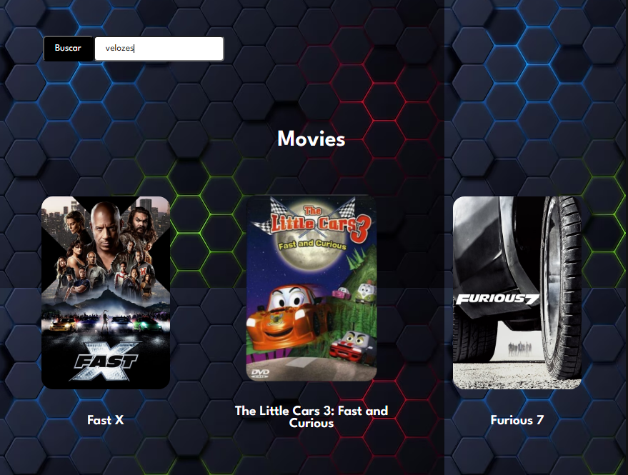

<html>

# Projeto utilizando a biblioteca react.

- O projeto apresentar os 20 filmes mais populares da atualidade.

- Ao clicar em algum filme você tera uma breve descrição de sobre o mesmo.

- Ao clicar no GIF direcionará ao site.
 
 

    
     
    

</html>

# Ferramentas utilizadas

- ReactJS

- React Router

- Styled Components